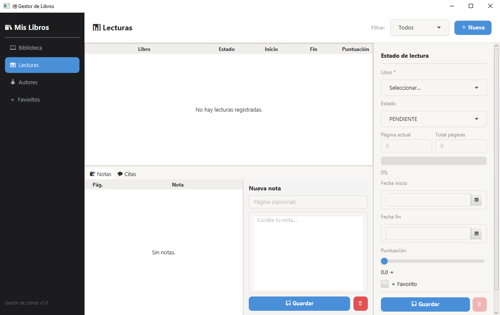

# Gestor de libros

Este gestor de libros es una pequeña aplicaión hecha con Java, SQL y JavaFX.

 

 

En ella se puede:

- Añadir libros con sus características (título, autor, género...)
- Añadir autores junto con una breve descripción
- Clasificar libros por su estado (PENDIENTE, LEIDO, LEYENDO o ABANDONADO)
- Llevar un seguimiento de lectura dependiendo de la página por la que vas leyendo y la fecha de comienzo y fin de la lectura.
- Puntuar libros con estrellas de 0-5
- Añadir libros a favoritos
- Añadir citas o notas a un libro
- Ver tus estadísticas según tu total de libros, tus libros/autores favoritos...

 

Ejecutar la aplicación:

``mvn javafx:run``
